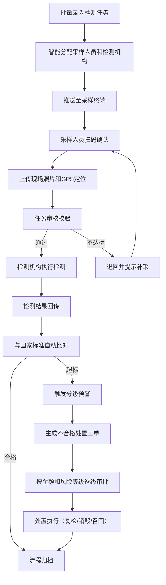
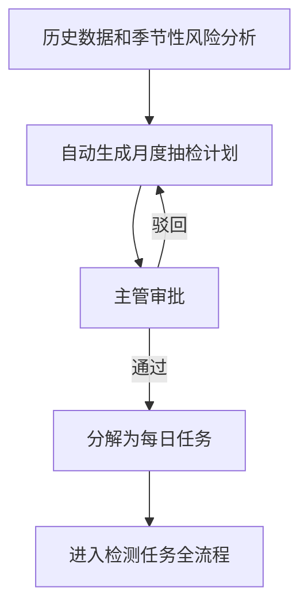
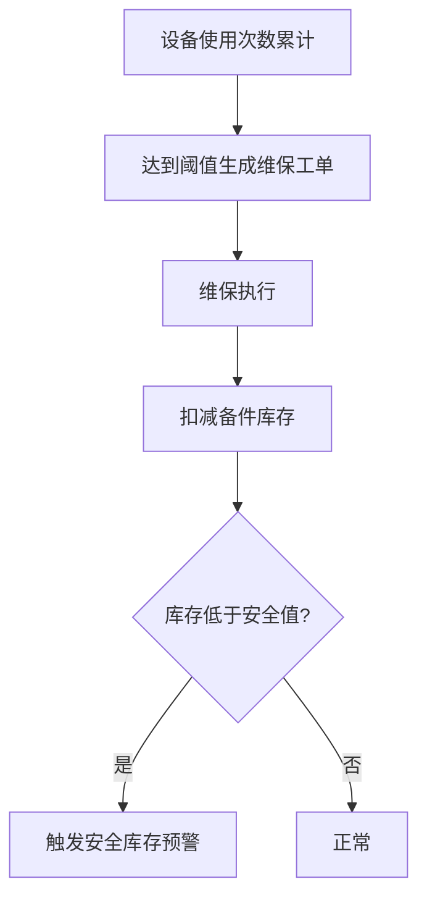

## 1. 产品概述

食品安全抽检管理系统是一套面向市场监管部门的数字化抽检全流程管理平台，覆盖检测任务批量录入、智能分配采样、现场采样确认、任务审核校验、检测结果比对预警、不合格处置审批、月度抽检计划生成、设备维保管理和统计分析等全链路环节。目标用户为市场监管部门管理人员、采样人员、检测机构和审批人员。

- 解决传统抽检流程中人工分配效率低、采样信息不透明、审核标准不统一、预警响应慢等核心痛点
- 通过自动化分配、智能比对、分级预警和可视化分析，实现抽检全流程数字化闭环，提升监管效率和食品安全保障水平

## 2. 核心功能

### 2.1 用户角色

| 角色 | 注册方式 | 核心权限 |
|------|----------|----------|
| 系统管理员 | 系统分配 | 全部功能权限、用户管理、系统配置 |
| 主管领导 | 系统分配 | 月度计划审批、处置工单审批、统计分析查看 |
| 任务调度员 | 系统分配 | 任务录入、任务分配、任务审核、计划管理 |
| 采样人员 | 系统分配 | 接收采样任务、扫码确认、上传照片和GPS、采样执行 |
| 检测机构人员 | 系统分配 | 接收检测任务、录入检测结果、结果回传 |
| 审批人员 | 系统分配 | 处置工单审批（按金额和风险等级分级） |

### 2.2 功能模块

1. **工作台首页**：数据概览、待办事项、预警通知、快捷入口
2. **检测任务管理**：批量任务录入、智能分配、任务状态跟踪
3. **采样管理**：任务推送、扫码确认、现场照片和GPS上传、采样执行
4. **任务审核**：样本量校验、时间窗口校验、检测项目完整性校验
5. **检测结果管理**：结果录入与回传、国家标准比对、超标预警、不合格处置工单生成
6. **处置审批**：处置工单管理、分级审批流程、审批记录
7. **月度抽检计划**：计划自动生成、主管审批、计划分解为每日任务
8. **设备维保管理**：使用次数追踪、维保工单自动生成、备件库存管理、安全库存预警
9. **统计分析**：区域/产品统计、采样完成率/合格率/处置率、PDF月报导出、地图热力分布

### 2.3 页面详情

| 页面名称 | 模块名称 | 功能描述 |
|----------|----------|----------|
| 工作台首页 | 数据概览 | 展示今日采样任务数、待审核任务、预警数、本月合格率等核心指标卡片 |
| 工作台首页 | 待办事项 | 按角色展示待处理任务列表，支持快速跳转处理 |
| 工作台首页 | 预警通知 | 实时显示超标预警和库存预警，点击可查看详情 |
| 工作台首页 | 快捷入口 | 提供录入任务、采样执行、审核任务、查看报告等常用功能快捷入口 |
| 检测任务管理 | 任务列表 | 展示所有检测任务，支持按状态、产品类别、风险等级、地域筛选和搜索 |
| 检测任务管理 | 批量录入 | 支持Excel/CSV导入和在线表单批量录入，含产品类别、风险等级、地域分布字段 |
| 检测任务管理 | 智能分配 | 根据产品类别、风险等级、地域自动匹配采样人员和检测机构，支持手动调整 |
| 检测任务管理 | 任务详情 | 展示任务全流程信息，包括分配结果、采样记录、检测进度和结果 |
| 采样管理 | 采样任务列表 | 采样人员视角，展示待采样/进行中/已完成任务 |
| 采样管理 | 扫码确认 | 扫描样本条码确认身份，关联任务信息 |
| 采样管理 | 现场采集 | 上传现场照片（支持多张）、GPS定位自动获取，支持手动微调 |
| 任务审核 | 审核列表 | 展示待审核任务，标注校验结果（通过/不通过及原因） |
| 任务审核 | 自动校验 | 系统自动校验样本量是否达标、采样时间窗口是否合规、检测项目是否完整 |
| 任务审核 | 退回补采 | 不达标任务退回，附带补采原因和具体要求提示 |
| 检测结果管理 | 结果列表 | 展示所有检测结果，标注是否超标、超标项目及倍数 |
| 检测结果管理 | 结果录入 | 检测机构录入各项检测指标值，系统自动与国标比对 |
| 检测结果管理 | 分级预警 | 超标触发黄色/橙色/红色三级预警，显示预警详情 |
| 检测结果管理 | 处置工单生成 | 超标项目自动生成不合格处置工单（复检/销毁/召回） |
| 处置审批 | 工单列表 | 展示所有处置工单，按风险等级和金额分类 |
| 处置审批 | 审批流程 | 按金额和风险等级逐级审批，支持审批意见和签名 |
| 处置审批 | 审批记录 | 查看工单完整审批链路和各节点状态 |
| 月度抽检计划 | 计划生成 | 根据历史数据和季节性风险自动生成月度抽检计划建议 |
| 月度抽检计划 | 计划审批 | 主管审批月度计划，支持修改和批注 |
| 月度抽检计划 | 任务分解 | 审批通过后自动分解为每日采样任务 |
| 设备维保管理 | 设备台账 | 设备列表展示使用次数、维保状态、下次维保时间 |
| 设备维保管理 | 维保工单 | 按使用次数自动生成维保工单，关联设备和使用记录 |
| 设备维保管理 | 备件库存 | 备件库存列表，维保工单自动扣减，低于安全库存预警 |
| 统计分析 | 数据看板 | 按区域、产品种类统计采样完成率、合格率和问题处置率 |
| 统计分析 | 月度报告 | PDF月度分析报告生成与导出 |
| 统计分析 | 地图热力图 | 电子地图实时显示各采样点任务进度与结果热力分布 |

## 3. 核心流程

**检测任务全流程**：任务批量录入 → 智能分配（产品类别+风险等级+地域） → 推送至采样终端 → 采样人员扫码确认 → 上传现场照片和GPS → 任务审核（样本量+时间窗口+项目完整性） → 通过/退回补采 → 检测机构执行检测 → 结果回传 → 国标比对 → 超标预警 → 生成处置工单 → 分级审批 → 处置执行 → 流程归档

**月度计划流程**：系统根据历史数据和季节性风险生成月度计划建议 → 主管审批 → 计划分解为每日任务 → 进入检测任务全流程

**设备维保流程**：设备使用次数累计 → 达到阈值自动生成维保工单 → 维保执行扣减备件 → 备件库存低于安全值触发预警

## 4. 用户界面设计

### 4.1 设计风格

- **主色调**：深蓝 (#0F2B46) + 明亮青色 (#00D4AA) 作为强调色，传达专业、可信赖的监管形象
- **辅助色**：预警黄 (#F5A623)、预警橙 (#FF6B35)、预警红 (#E63946) 对应三级预警
- **背景**：深色系仪表盘风格，#0A1628 深色底 + 半透明毛玻璃卡片
- **按钮风格**：圆角8px，主按钮青色渐变，危险操作红色，hover带发光效果
- **字体**：标题使用 Noto Sans SC Bold，正文使用 Noto Sans SC Regular，数字使用 DM Mono
- **布局风格**：左侧固定导航栏 + 顶部面包屑 + 右侧内容区，卡片式模块布局
- **图标**：线性图标风格，统一使用 Lucide Icons
- **动效**：卡片hover上浮+投影增强，数据加载骨架屏，预警卡片脉冲动画，数字增长动画

### 4.2 页面设计概览

| 页面名称 | 模块名称 | UI元素 |
|----------|----------|--------|
| 工作台首页 | 数据概览 | 4个统计卡片（渐变底+大号数字+增长率指标），深色毛玻璃质感 |
| 工作台首页 | 待办事项 | 列表卡片，左侧色条标识优先级，右侧操作按钮 |
| 工作台首页 | 预警通知 | 预警卡片带脉冲动画边框，颜色对应预警级别 |
| 工作台首页 | 快捷入口 | 4个图标按钮网格，hover时图标放大+背景发光 |
| 检测任务管理 | 任务列表 | 表格+筛选栏，状态列使用彩色标签，风险等级使用图标标识 |
| 检测任务管理 | 批量录入 | 模态对话框，支持拖拽上传区域，表单分组展示 |
| 检测任务管理 | 智能分配 | 左侧待分配列表，右侧分配结果面板，拖拽或点击分配 |
| 采样管理 | 采样任务列表 | 卡片列表，每张卡片显示任务关键信息+距离+倒计时 |
| 采样管理 | 扫码确认 | 全屏扫码界面，扫描框动画，确认后显示任务详情弹窗 |
| 采样管理 | 现场采集 | 底部操作栏：拍照/选择照片+定位图标+提交按钮，照片网格预览 |
| 任务审核 | 审核列表 | 表格，自动校验结果列使用✓/✗图标，支持批量操作 |
| 任务审核 | 退回补采 | 侧滑面板，显示具体不达标项，文本框填写补采说明 |
| 检测结果管理 | 结果列表 | 表格，超标行红色高亮，合格行正常显示，预警标签 |
| 检测结果管理 | 分级预警 | 预警横幅（全宽），颜色对应级别，显示超标详情和处置建议 |
| 处置审批 | 工单列表 | 卡片列表，顶部筛选标签（全部/待审批/已审批），风险等级色标 |
| 处置审批 | 审批流程 | 步骤条展示审批链路，当前节点高亮，历史节点显示审批人和时间 |
| 月度抽检计划 | 计划生成 | 月度日历视图，每天标注计划任务数，右侧统计摘要 |
| 月度抽检计划 | 计划审批 | 审批页面，左侧计划详情，右侧审批操作区 |
| 设备维保管理 | 设备台账 | 设备卡片网格，显示使用进度条和维保状态标签 |
| 设备维保管理 | 备件库存 | 表格，库存列使用进度条，低于安全值红色高亮+闪烁 |
| 统计分析 | 数据看板 | 4个核心指标卡片+图表区（柱状图/饼图/趋势图），Tab切换区域/产品维度 |
| 统计分析 | 地图热力图 | 全屏地图，采样点标记+热力图层，左侧信息面板，底部图例 |

### 4.3 响应式设计

- 桌面优先设计，主要面向1920px和1440px屏幕
- 平板端（768px-1024px）：侧边栏收缩为图标模式，卡片从4列变2列
- 移动端（<768px）：底部Tab导航，卡片单列，采样人员端优先适配移动操作

### 4.4 3D场景指导

不适用
