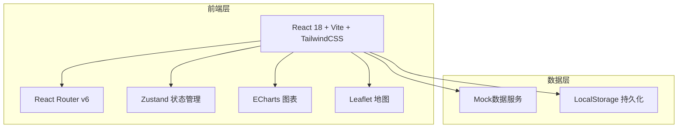
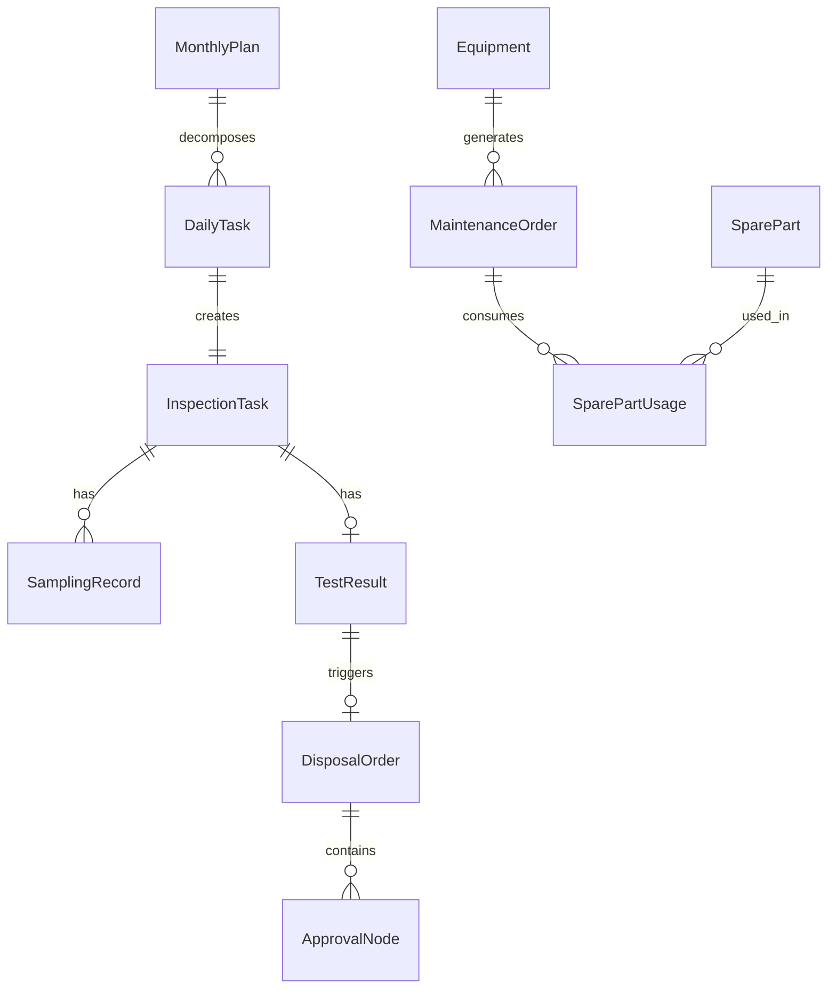

## 1. 架构设计



## 2. 技术说明

- **前端框架**：React@18 + TypeScript
- **构建工具**：Vite
- **样式方案**：TailwindCSS@3
- **路由**：React Router v6
- **状态管理**：Zustand
- **图表库**：ECharts（柱状图、饼图、趋势图、热力图）
- **地图库**：Leaflet + React-Leaflet（电子地图、热力分布）
- **数据方案**：Mock数据（无后端），LocalStorage持久化
- **图标**：Lucide React
- **PDF导出**：html2canvas + jsPDF
- **动画**：Framer Motion
- **后端**：无（纯前端演示）
- **数据库**：无（Mock数据 + LocalStorage）

## 3. 路由定义

| 路由 | 用途 |
|------|------|
| / | 工作台首页 - 数据概览和待办事项 |
| /tasks | 检测任务管理 - 任务列表 |
| /tasks/create | 批量录入检测任务 |
| /tasks/:id | 任务详情 |
| /sampling | 采样管理 - 采样任务列表 |
| /sampling/:id | 采样执行（扫码确认+现场采集） |
| /review | 任务审核 - 审核列表 |
| /results | 检测结果管理 - 结果列表 |
| /results/:id | 检测结果详情与比对 |
| /disposal | 处置审批 - 工单列表 |
| /disposal/:id | 处置审批详情 |
| /plan | 月度抽检计划 |
| /equipment | 设备维保管理 |
| /equipment/spare-parts | 备件库存管理 |
| /statistics | 统计分析 - 数据看板 |
| /statistics/map | 地图热力图 |
| /statistics/report | 月度分析报告 |

## 4. API定义

无后端，使用Mock数据服务。定义以下数据接口类型：

```typescript
interface InspectionTask {
  id: string
  productName: string
  productCategory: string
  riskLevel: 'low' | 'medium' | 'high'
  region: string
  sampleCount: number
  samplingPersonnel?: string
  testingAgency?: string
  status: 'pending' | 'assigned' | 'sampling' | 'sampled' | 'reviewing' | 'testing' | 'completed' | 'rejected'
  createdAt: string
  deadline: string
}

interface SamplingRecord {
  id: string
  taskId: string
  sampleCode: string
  photos: string[]
  gpsLocation: { lat: number; lng: number }
  sampledAt: string
  confirmedBy: string
}

interface TestResult {
  id: string
  taskId: string
  items: TestItem[]
  overallResult: 'qualified' | 'unqualified'
  alertLevel?: 'yellow' | 'orange' | 'red'
  testedAt: string
}

interface TestItem {
  name: string
  value: number
  standard: number
  unit: string
  isExceeded: boolean
  exceedMultiple?: number
}

interface DisposalOrder {
  id: string
  taskId: string
  type: 'retest' | 'destroy' | 'recall'
  riskLevel: 'low' | 'medium' | 'high'
  amount: number
  status: 'pending' | 'approved' | 'rejected' | 'completed'
  approvalChain: ApprovalNode[]
}

interface ApprovalNode {
  level: number
  approver: string
  status: 'pending' | 'approved' | 'rejected'
  comment?: string
  timestamp?: string
}

interface MonthlyPlan {
  id: string
  month: string
  totalTasks: number
  status: 'draft' | 'pending_approval' | 'approved' | 'rejected'
  dailyTasks: DailyTask[]
  generatedAt: string
  approvedBy?: string
}

interface Equipment {
  id: string
  name: string
  model: string
  usageCount: number
  maintenanceThreshold: number
  status: 'normal' | 'maintenance_due' | 'under_maintenance'
  nextMaintenance?: string
}

interface SparePart {
  id: string
  name: string
  stock: number
  safetyStock: number
  unit: string
}
```

## 5. 服务器架构图

不适用（纯前端项目）

## 6. 数据模型

### 6.1 数据模型定义



### 6.2 数据定义语言

使用Mock数据初始化，LocalStorage持久化，无DDL语句。
